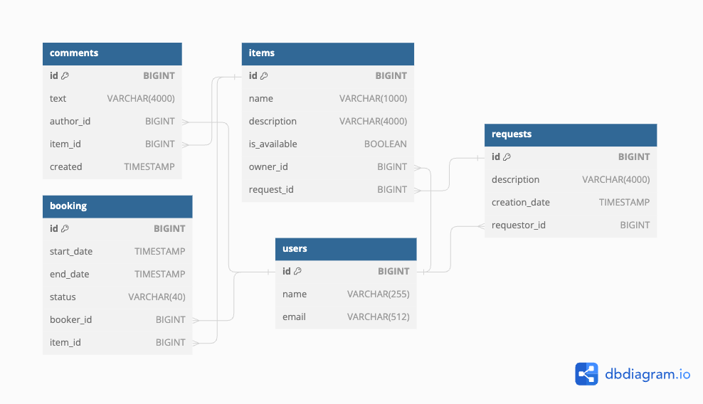

# java-shareit

## _Description_

Service for items sharing.
Project allows users to 

* add/update/delete items
* get items by owner or id
* search items by matching the text in the name or description
* book items
* comment booked items
* approve or reject booking request (when one is an owner of item)
* get booking information by owner, id and special status of booking
* make requests for items
* get all requests, requests by requestor or id

## _Used HTTP methods_

| Method | Description                                       |
|--------|---------------------------------------------------|
| GET    | Get users, items, bookings, requests              |
| POST   | Post users, items, comments, bookings, requests   |
| PATCH  | Update users, items, bookings                     |
| DELETE | Delete users, items                               |

## _Possible HTTP response codes_

| Code | Description                    |
|------|--------------------------------|
| 200  | OK                             |
| 400  | Bad request                    |
| 404  | Not found                      |
| 500  | Internal server error          |

## _End points_

> Users controller

| Method | URL                        | Description                  | Params                                            |
|--------|----------------------------|------------------------------|---------------------------------------------------|
| GET    | /users                     | Returns all users            | n/a                                               |
|        | /users/{userId}            | Returns user by id           | id > 0                                            |
| POST   | /users                     | Create user                  | requires json body (correct email, not blank name)|
| PATCH  | /users/{userId}            | Update user's attributes     | id > 0, requires json body                        |
| DELETE | /users/{userId}            | Delete user by id            | id > 0                                            |

> Items controller  
> Header X-Sharer-User-Id = user's id

| Method | URL                        | Description                                     | Params                                           |
|--------|----------------------------|-------------------------------------------------|--------------------------------------------------|
| GET    | /items                     | Returns items                                   | from - the number of item, size - items per page |
|        | /items/{itemId}            | Returns item by id                              | id > 0                                           |
|        | /items/search              | Returns items name/description like search-text | id > 0                                           |
| POST   | /items                     | Create item                                     | requires json body                               |
| POST   | /items/{itemId}/comments   | Create comment                                  | requires json body with comment text             |
| PATCH  | /items/{id}                | Update item's attributes                        | id > 0, requires json body                       |
| DELETE | /items/{id}                | Delete item by id                               | id > 0                                           |

> Bookings controller  
> Header X-Sharer-User-Id = user's id  
> Parameter state can be: ALL, WAITING, REJECTED, PAST, CURRENT, FUTURE 

| Method | URL                        | Description                         | Params                                                  |
|--------|----------------------------|-------------------------------------|---------------------------------------------------------|
| GET    | /bookings                  | Returns booking by state            | from - the number of item, size - items per page, state |
|        | /bookings/owner            | Returns booking by owner and state  | from - the number of item, size - items per page, state |
|        | /bookings/{id}             | Returns bookings by id              | id > 0                                                  |
| POST   | /bookings                  | Create booking                      | requires json body                                      |
| PATCH  | /bookings/{id}             | Approves or rejects booking request | id > 0, approved (true/false)                           |

> Requests controller  
> Header X-Sharer-User-Id = user's id

| Method | URL                        | Description                          | Params                                           |
|--------|----------------------------|--------------------------------------|--------------------------------------------------|
| GET    | /requests                  | Returns all requests by requestor    | n/a                                              |
|        | /requests/all              | Returns requests                     | from - the number of item, size - items per page |
|        | /requests/{id}             | Returns request by id                | id > 0                                           |
| POST   | /requests                  | Create request                       | requires json body                               |

## _Project structure_

> Used Spring boot 2.7.9 
> Spring Data JPA, Hibernate
> Java version 11
> Docker
> Has services:
> * gateway (check request's parameters)
> * server (logic)

## _Database architecture_

### Basics

> Used
> PostgreSQL version 14.10 

### ER diagram

